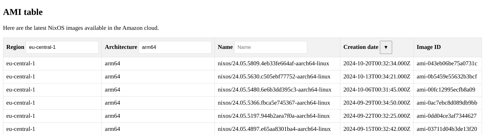

# Scalable and secure NixOS deploys on AWS

---

## Me

* Arian van Putten (`@arianvp`)
* NixOS maintainer (ACME, systemd, cloud)
* Infra @ Mercury.com

---

## Nix and NixOS at Mercury

* Hundreds of engineers deploying changes to production multiple times per day.


SPEAKER:

* Nix shell for development
* Haskell app
* Stateless application servers NixOS
* Database
* Stateful supporting services NixOS

---

## Deploys a year ago


* `nix-copy-closure --to ssh://$host`

SPEAKER:

* Engineers using Github Actions for CI
* Infra team using Hydra for CD
* Long lived EC2 instances
* Manually added to inventory to deploy to
* Hydra continously builds NixOS configurations and pushes them out with `nix-copy-closure` over ssh
* Similar to NixOps, Colemna, deploy-rs etc
* Some hooks to drain from load-balancer before nixos-rebuild switch


---

## Issues


SPEAKER: 

* Artifacts built twice in GHA and Hydra
* Separate repos for app and infra
* Infra tracks different nixpkgs than backend
* Hard to track deploy status for engineers
* New instances manually added to inventory
* Bastion host and key management for ssh access 
* Kernel updates and NixOS upgrades  coordination
* Setting up new instances tedious due to old AMI. Requires reboot


---

## Goals

### Empower engineers

* Visibility into deploy status
* Faster deploys
* Richer deploy strategies

---

## Goals

### Reduce toil for infra team

* Adding new instances to inventory automatic
* Up to date base images
* Automate rollout of changes requiring reboot

SPEAKER:

* There was quite a bit of manual work for infrastructure engineers
* Shouldn't require to reboot new instances due to old AMI when creating new instances


---

## Goals

### Improve security

* No need for bastion host
* Up to date base images
* Easy to roll out updates quickly


---

## Proposed solution - pipeline


SPEAKER:

### Solution

* Github Actions for CI/CD
* Single repository
* Restrict deploy to environments / branches
  * Developers can stage pull requests to staging environments
  * Only main branch can access production environments
* AWS APIs instead of SSH to manage deploys
* AWS IAM for scoped authentication

---

## Proposed solution - deploy primitives

* Stateless: Auto scaling groups
* Stateful: AWS Systems Manager


SPEAKER:
* Auto Scaling Groups using instance refresh, for stateless services
  * Allow for rolling releases, blue-green, canary, rollbacks etc.
* AWS Systems Manager State Manager for stateful services
  * Reconcile in-place NixOS upgrades
  * Authenticate using IAM roles instead of SSH.
  * No bastion host
  * No keys to manage

---

## Projects

* Image Build and Upload Automation pipeline
* Auto scaling group support for NixOS
* AWS Systems Manager State Manager support for NixOS
* Authentication between Github Actions and AWS

---

## Image Build and Upload Automation

* AMIs were only uploaded once per release. Manual process
* Outdated kernels and security vulnerabilities on first boot
* NixOS release managers had no interest in maintaining AWS support. too much toil.

---

## Image Build and Upload automation

* Since 24.05 AMIs are now maintained again!
* Automated weekly upload using Github Actions

SPEAKER:

* Took over maintance of AWS support in NixOS
* Built a github actions pipeline to build and upload NixOS AMIs regularly
* AMIs now uploaded for every channel bump since 24.05

---

## Image build and Upload Automation


* https://github.com/nixos/amis
* https://nixos.org/download/#nixos-amazon
* `nix run github:NixOS/amis#upload-ami `



SPEAKER:

* AMIs now uploaded for every channel bump since 24.05
* You can use the tooling to upload your own AMIs too!

---

## How to use Autoscaling groups with NixOS

---

## What is Autoscaling groups


SPEAKER:

* Fleet of instances using a common configuration called a **Launch Template**
  * Define the image, instance type, and user data
* instances scaled up and down on demand, created according to launch template
* Balanced across availability zones for high availability
* Associated with a load balancer to distribute traffic
* Automatically drain instances from load balancer before termination

---

## Creating an Autoscaling groups

```terraform
resource "aws_auto_scaling_group" "webserver" {
  name     = "webserver"
  min_size = 1
  max_size = 10
  vpc_zone_identifier = [ eu-central-1a, eu-central-1b ]
  launch_template {
    id      = aws_launch_template.webserver.id
  }
  target_group_arns = [aws_lb_target_group.webserver.arn]
  health_check_type = "ELB"
  instance_refresh {
    strategy = "Rolling"
  }
}
```

SPEAKER: 

* Define availability zones (Subnets)
* Attach to load balancer
* Scaling parameters
* Launch template

---

## Launch Template


```
resource "aws_launch_template" "webserver" {
  name          = "webserver"
  image_id      = var.image_id
  instance_type = "t4g.small"
  user_data     = base64(file("${path.module}/provision.sh"))
  iam_instance_profile = "Read from S3, Access Database"
}
```

SPEAKER:

* Define all properties of instances
* What permissions does the instance have
  * Machines can access our app database
  * Machines can access our binary cache
* What instance type
* What base image
* Startup script

---

## Launch Template Versions

<pre><code data-trim data-line-numbers="6">
resource "aws_auto_scaling_group" "webserver" {
  name     = "webserver"
  ...
  launch_template {
    id      = aws_launch_template.webserver.id
    version = aws_launch_template.webserver.latest_version
  }
</code></pre>

SPEAKER:

* Updating a launch template creates immutable version
* Auto scaling group points to a specific version

---

## Launch Template Versions

* Like nix profiles, but for instances


SPEAKER:

* Say we have deployed `image-1`
* But we want to deploy `image-2`

---

## Launch Template Versions

* Like nix profiles, but for instances


SPEAKER:

* Point to a new launch template, and new instances use the new image

---

## Instance refresh

* Think "nixos-rebuild switch to new generation"

```
resource "aws_auto_scaling_group" "webserver" {
  launch_template {
    id = "lt-23238283"
    version = 4 -> 5
  }
  instance_refresh {
    strategy               = "Rolling"
    checkpoint_percentages = [ 50, 100 ]
    min_healthy_percentage = 50
    max_healthy_percentage = 150
    auto_rollback          = true
  }
}
```

SPEAKER:

* Roll out new instances according to new launch template version
* Manage load balancer registration and deregistration
* Rollback to previous version if new version fails health checks

---

# Iteration 1: Build AMI per release


---

## Build AMI with NixOS

```nix
# ./nix/hosts/webserver.nix
{ config, pkgs, ... }: {
  imports = [
    "${pkgs}/nixos/maintainers/scripts/ec2/amazon-image.nix"
  ];
  amazonImage.sizeMB = "auto";
  system.name = "webserver";
  system.stateVersion = "24.11";
  nixpkgs.hostPlatform.system = "aarch64-linux";
  services.nginx.enable = true;
  networking.firewall.allowedTCPPorts = [ 80 ];
}
```

```bash
$ nix build '.#hydraJobs.webserver.amazonImage'
$ nix run 'github:NixOS/amis#upload-ami' -- ./result

ami-7654321098abcdef0
```

SPEAKER:

* Can easily build AMIs from NixOS configs
* Upload them with `upload-ami`


---

## Deploy with Terraform

```
TF_VAR_image_id=ami-7654321098abcdef0 terraform apply
```

```text
# aws_launch_template.webserver will be updated in-place
~ resource "aws_launch_template" "webserver" {
      id                      = "lt-0945d5011bf2bb1d7"
    ~ latest_version          = 4 -> (known after apply)
    ~ image_id                = "ami-1234567890abcdef0" -> 
        "ami-7654321098abcdef0"
  }
```

SPEAKER:

* Update the launch template With the new AMI
* Roll out release with instance refresh

---

## Problems

* Uploading is slow (5-10 minutes)
* Uses a lot of storage space. No deduplication of common dependencies between AMIs

---

# Iteration 2: Use user-data to provision instances

---


SPEAKER:

* Use same image in each version
* Specify in launch template what closure to deploy
* Launch Template has permissions to access S3 bucket
* Fetch closure from S3 bucket
* Switch to new configuration on startup

---

## Specify nix store path in launch tempalte

<pre><code data-trim data-line-numbers="5,7,11">
resource "aws_launch_template" "webserver" {
  name     = "webserver"
  image_id = data.aws_ami.nixos.id
  metadata_options {
    instance_metadata_tags = "enabled"
  }
  user_data = file("./provision.sh")
  tag_specifications {
    resource_type = "instance"
    tags = {
      NixStorePath      = "${var.nix_store_path}"
      Substituters      = "s3://nixcon2024-cache"
    }
  }
</code></pre>

SPEAKER:

* We attach a `provision.sh` script to the launch template
* This script runs at startup and provisions the instance
* We attach what nix store path to deploy and where to fetch it from as tags to the instance

---

## `provision.sh`

* Fetchs tags from instance metadata service

<pre><code data-trim data-line-numbers="3-5,10">
#!/bin/sh
meta=169.254.169.254
get_tag() {
  curl "http://$meta/latest/meta-data/tags/instance/$1"
}
profile=/nix/var/nix/profiles/system
nix build \
  --substituters "$(get_tag Substituters)" \
  --profile "$profile" \
  "$(get_tag NixStorePath)"

"$profile/bin/switch-to-configuration" boot
systemctl start kexec.target
</code></pre>

---

## `provision.sh`

* Substitute store path

<pre><code data-trim data-line-numbers="7-10">
#!/bin/sh
meta=169.254.169.254
get_tag() {
  curl "http://$meta/latest/meta-data/tags/instance/$1"
}
profile=/nix/var/nix/profiles/system
nix build \
  --substituters "$(get_tag Substituters)" \
  --profile "$profile" \
  "$(get_tag NixStorePath)"

"$profile/bin/switch-to-configuration" boot
systemctl start kexec.target
</code></pre>

---


## `provision.sh`

* Reboot into new configuration

<pre><code data-trim data-line-numbers="12-13">
#!/bin/sh
meta=169.254.169.254
get_tag() {
  curl "http://$meta/latest/meta-data/tags/instance/$1"
}
profile=/nix/var/nix/profiles/system
nix build \
  --substituters "$(get_tag Substituters)" \
  --profile "$profile" \
  "$(get_tag NixStorePath)"

"$profile/bin/switch-to-configuration" boot
systemctl start kexec.target
</code></pre>

SPEAKER:

* Why reboot? switch-to-configuration is not perfect. This is more reliable
* e.g. switch-to-configuration doesn't restart dbus, udev

---

## Terraform module 

<pre><code data-trim data-line-numbers="8">
module "nix_cache_bucket" { source = "./modules/nix_cache_bucket" }
module "webserver_launch_template" {
  source         = "./modules/nixos_launch_template"
  name           = "webserver"
  nix_cache      = module.nix_cache_bucket
  installable    = var.nix_store_path
}
</code></pre>

<pre><code data-trim data-line-numbers="4,6-8">
resource "aws_auto_scaling_group" "webserver" {
  launch_template {
    id      = module.webserver_launch_template.id
    version = module.webserver_launch_template.latest_version
  }
  instance_refresh {
    strategy = "Rolling"
  }
}
</code></pre>

SPEAKER:

* abstracted this in a terraform module
* Published on github

---

## Deploy using terraform

```bash
store_path=$(nix build '.#hydraJobs.webserver')
```

```bash
nix copy --to s3://nixcon2024-cache-bucket $store_path
```

```bash
TF_VAR_nix_store_path=$store_path terraform apply
```

---

## Deploy using terraform
```
~ resource "aws_launch_template" "this" {
      id                      = "lt-0945d5011bf2bb1d7"
    ~ latest_version          = 4 -> (known after apply)
    ~ tag_specifications {
        ~ tags          = {
            ~ "Installable" = "/nix/store/g1blfd8wjmwl050h08r2crmg8c1sfhd6-nixos-system-webserver-24.11.20240929.06cf0e1" 
            -> "/nix/store/p6b3p154bsc7w13w92jqpvgwk8xyci86-nixos-system-webserver-24.11.20240929.06cf0e1"
          }
      }
  }
```

```
~ resource "aws_autoscaling_group" "webserver" {
    ~ launch_template {
          id      = "lt-0945d5011bf2bb1d7"
        ~ version = "4" -> (known after apply)
      }
  }
```

SPEAKER:

* Updating nix store path tag
* Changing launch template creates new version
* New version changes auto scaling group
* Triggers instance refresh

---

## Iteration 3: Deploy using AWS CLI directly

* Terraform support for instance refresh wonky (https://github.com/hashicorp/terraform-provider-aws/issues/34189)
* Rollbacks do not work
* Does not wait for instance refresh to complete

---

## AWS CLI

```bash
version=$(aws ec2 create-launch-template-version \
  --launch-template-name $name \
  --source-version \$latest \
  --launch-template-data \
    'TagSpecifications=[{ResourceType=instance,Tags=[{Key=Installable,Value=$store_path}]}]'
)
aws autoscaling start-instance-refresh \
  --auto-scaling-group-name "$auto_scaling_group_name" \
  --desired-configuration "{Name=$name,Version=$version}" \
  --strategy Rolling
```

---

## Wrapped in Github Workflow
```yaml
build:
  uses: ./.github/workflows/build-and-push.yml
  with:
    role-to-assume: arn:aws:iam::xxx:role/nix-build
    store-uri: s3://nix-cache-bucket
    installable: '#hydraJobs.webserver'
```
```yaml
deploy:
  uses: ./.github/workflows/instance-refresh.yml
  needs: build
  with:
    role-to-assume: arn:aws:iam::xxx:role/deploy-production
    environment: production
    auto-scaling-group-name: webserver
    launch-template-name: webserver
    installable: ${{ jobs.build.outputs.nix-store-path }}
```
---

## Auto Scaling Groups:  conclusion


SPEAKER:

* Instance Refresh through API instead of ssh access
* Reboot to upgrade solved. Always create new instances!
* Rollbacks, Canary deploys possible
* Triggered from Github Actions pipeline

---

# Stateful services


* Upgrade in place instead of destroying and recreating instances

SPEAKER:

* Some things not a good fit for ASGs
* e.g. don't want to throw away prometheus metrics on upgrade
* Need mechanism to upgrade in place (nixos-rebuild switch/boot)

---

## AWS Systems Manager 

* agent shipped with NixOS since 24.05
* Remote access for admins
* AWS can send "documents" to instances. Idempotent playbooks

---

## Security vs SSH


SPEAKER: 

* Instances can be in private subnet
* No need for bastion host
* Identity-based authentication, auto-key rotation
* Audit logging

---

## Define an instance

```terraform
resoure "aws_instance" "prometheus" {
  count    = 2
  image_id = data.aws_ami.nixos.id
  root_block_device { volume_size = 1000 }
  tags = { Role = "prometheus" }
}
```

```nix
{
  imports = ["${modulesPath}/virtualisation/amazon-image.nix"];
  system.name = "prometheus";
  services.prometheus.enable = true;
}
```

SPEAKER:

* Note the role tag!


---

## Create NixOS-Deploy document
* Basically the same as launch-template user-data script.
* `nixos-rebuild switch` is idemptotent
* Published as terraform module
```
module "nixos_deploy_ssm_document" {
  source = "modules/nixos_deploy_ssm_document"
}
```

SPEAKER:

* We created an SSM Document that can do switch-to-configuration

---

## Associate instances with SSM document


<pre><code data-line-numbers="2,5,8" data-trim>
resource "aws_ssm_association" {
  name = module.nixos_deploy_ssm_document.name
  paramters = {
    substituters = module.nix_cache_bucket.store_uri
    installable  = var.nix_store_path
    action       = "switch" # or "reboot"
  }
  targets { key = "tag:Role", values = ["prometheus"] }
  max_concurrency = "50%"
  max_errors      = "50%"
}
</code></pre>

SPEAKER:

* What store path to deploy
* From what cache to fetch
* Which instances to target
* Whether to reboot or switch in place
* Rollout strategy

---

## Deploy
```bash
#!/bin/sh

store_path=$(nix build '.#hydraJobs.prometheus')
nix copy --to s3://nix-cache-bucket
TF_VAR_nix_store_path=$store_path terraform apply
```

SPEAKER:

* Will start applying the config in-place
* targets all instances that have the tag
* New instances automatically applied to
* Can stop rollout if too many errors

---

## Stateful services: Summary


SPEAKER:

* In-place upgrades. State preserved
* No more need for SSH bastion host

---

## How to authenticate our CD pipeline to AWS?

* Need credentials to talk to AWS APIs

---

## How to authenticate our instances to AWS?

* Fetch nix closure from cache
* Connect to AWS Systems Manager
* Application itself needs to authenticate to other AWS services
  * S3 buckets
  * RDS databases
  * Secrets Manager secrets
  * CloudWatch logs

---

## AWS IAM Roles and Policies


SPEAKER:

* Role is an identity that can be assumed by another entity
* Can by assumed by:
  * AWS Services (your EC2 instance, Lambda Functions)
  * SSO identities (your employees)
  * **Other federated identities (e.g. Github Actions)**
* Role has attached policies that define permisisons
* Role credentials are temporary and rotated automatically
* Credentials sign requests. No bearer tokens that can leak in request logs

---

## ID Tokens in Github Actions
* Github actions exposes ID token JWT signed by Github
* Scoped to specific repository, branch, or Github Environment
* Unique per workflow run
* Signed with well-known key

---

## ID Tokens for push to production

```yaml
on:
  push: { branches: [main] }
job:
 deploy:
   permissions: { id-token: write }
   environment: production
```

```
{
  "iss": "https://token.actions.githubusercontent.com",
  "sub": "repo:arianvp/nixcon2024:environment:production",
  "aud": "sts.amazonaws.com"
}
```

SPEAKER:

* Point out subject claim

---

## ID Token for pull request

```yaml
on:
  pull_request:
job:
  build:
    permissions: { id-token: write }
```
```
{
  "iss": "https://token.actions.githubusercontent.com",
  "sub": "repo:arianvp/nixcon2024:pull_request",
  "aud": "sts.amazonaws.com"
}
```

SPEAKER:

* Point out subject claim

---

## Trust policy for IAM Role

<pre><code data-trim data-line-numbers="2,4,9,11">
"Effect": "Allow",
"Action": "sts:AssumeRoleWithWebIdentity",
"Principal": {
  "Federated": "token.actions.githubusercontent.com"
},
"Condition": {
  "StringEquals": {
    "token.actions.githubusercontent.com:aud": 
      "sts.amazonaws.com",
    "token.actions.githubusercontent.com:sub":
      "repo:arianvp/nixcon2024:pull_request"
  }
}
</code></pre>

SPEAKER:

* Trust policy defines who can assume the role under what conditions
* If Signed by Github
* If target audience is AWS 
* If request came from a pull request
---

## Define role

<pre><code data-trim data-line-numbers="3,8">
resource "aws_iam_role" "nix_build" {
  name = "nix-build"
  assume_role_policy = file("trust-policy.json")
}

resource "aws_iam_role_policy_attachment" "write" {
  role       = aws_iam_role.nix_build.name
  policy_arn = module.nix_cache_bucket.write_policy_arn
}
</code></pre>


---

## Use role in Github Actions

<pre class="yaml"><code data-trim data-line-numbers="7,9">
build:
  permissions:
    id-token: write 
  steps:
    - uses: aws-actions/configure-aws-credentials@v14
      aws-region: eu-central-1
      role-to-assume: arn:aws:iam:xxx:role/nix-build
    - run: nix build
    - run: nix copy --to s3://nix-cache-bucket
</code></pre>

---

## Deploys

* Scoped to Github environments (production, staging)
* Branch protection rules
  * `prod` <-> `main` branch
  * `staging` <-> pull request branches

---

## Deploy Policy

<pre class="json"><code data-trim data-line-numbers="5,9">
resource "iam_policy" "deploy_production" {
  policy = jsonencode({
    Statement = [{
      Effect = "Allow",
      Action = ["autoscaling:StartInstanceRefresh"],
      Resource = "*"
      Condition = {
        StringEquals = {
          "aws:ResourceTag/Environment" = "production"
        }
      }
    }]
  })
}
</code></pre>

SPEAKER:

* A policy that allows deploys to ASGs with production tag

---

## Production role trust policy

<pre><code data-trim data-line-numbers="6">
resource "aws_iam_role" "deploy_production" {
  name = "deploy-production"
  assume_role_policy = jsonencode({
    ...
    "token.actions.githubusercontent.com:sub":
      "repo:arianvp/nixcon2024:environment:production"
  })
}

resource "aws_iam_role_policy_attachment" "deploy" {
  role       = aws_iam_role.deploy_production.name
  policy_arn = aws_iam_policy.deploy_production.arn
}
</code></pre>

---

## Use role in Github Actions

<pre><code data-trim data-line-numbers="3,7,9">
deploy:
  permissions:
    id-token: write
  steps:
    uses: ./.github/workflows/instance-refresh.yml
    with:
      environment: production
      aws-region: eu-central-1
      role-to-assume: arn:aws:iam:xxx:role/deploy-production
</code></pre>

---


SPEAKER:

1. Github Actions exchanges id token for role credential
2.  Role gives access to certain permissions
3. Can use credential to upload to S3
4. Can't use credential to do deploy
5. Server can use its credential to download from S3

---

## Conclusion

* Unified CI and CD pipeline, visibility for developers
* Secure rollout at scale using auto scaling groups and AWS SSM
* Strong cryptographic identity using Github Actions ID tokens and IAM Roles
* **No credentials or secrets to manage at all**

---

## Use AWS and NixOS? Talk to me!


* Join our matrix [`#aws:nixos.org`](https://matrix.to/#/#aws:nixos.org)
* https://github.com/nixos/amis

* https://github.com/arianvp/nixcon2024 


---

## Future work
* Want to bring more AWS improvements to NixOS
* Better image builder tooling using systemd-repart
* Repartitioning root volume
* Lifecycle hooks for autoscaling groups
* SecureBoot?
* CloudWatch logging

---

## Questions ?